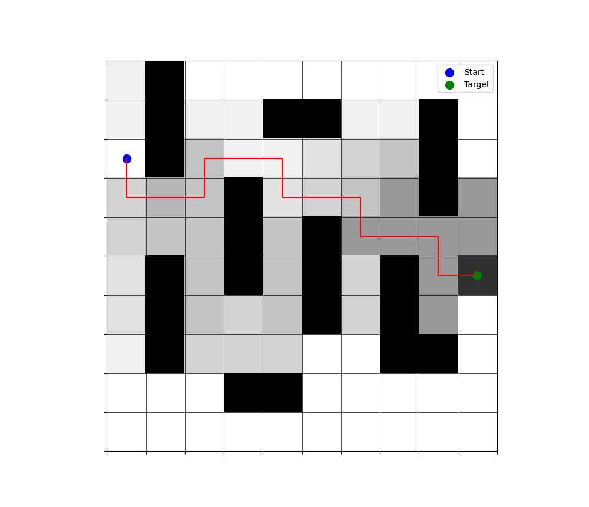
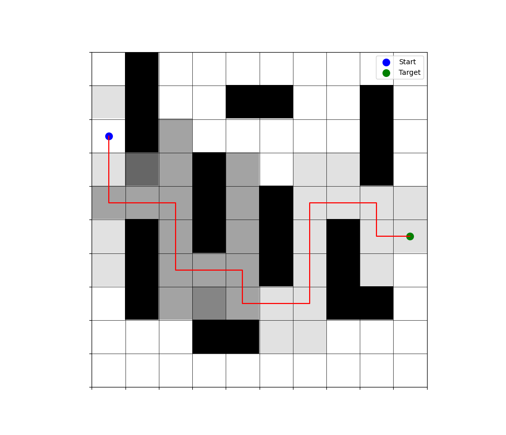

# search-method

## 利用A*搜索算法来解决在地图中寻找从起点到终点的最佳路径
评价函数$f(n) = g(n) + h(n)$，其中$g(n)$表示从起点到达节点$n$的代价，$h(n)$表示从节点$n$到终点的估计代价，这里的$h(n)$采用曼哈顿距离来估计从节点$n$到终点的代价。

通过格子的的灰度来反应格子被作为节点拓展的次数，代码最终得到结果如图所示

对于这个问题，程序反应我们最终经过了$90$次搜索

## 通过加权A*搜索来减少搜索量
对于最原始的搜索方法，搜索量是较大的，我们也可以看到我们搜索了较多与终点无关的格子，在这里我们可以对于评价函数的两个部分来重新分配权重以减少搜索量
$$
    f(n) = g(n) + w * h(n) (w > 1)
$$ 
通常情况下，我们的算法会更快地收敛到结果，但此时的结果未必是代价最优的。对于刚才的问题，我们取$w = 2$来重新进行求解，此时的搜索次数为42，效率提高了一倍，但是如图所示，我们得到的结果是次优的。
